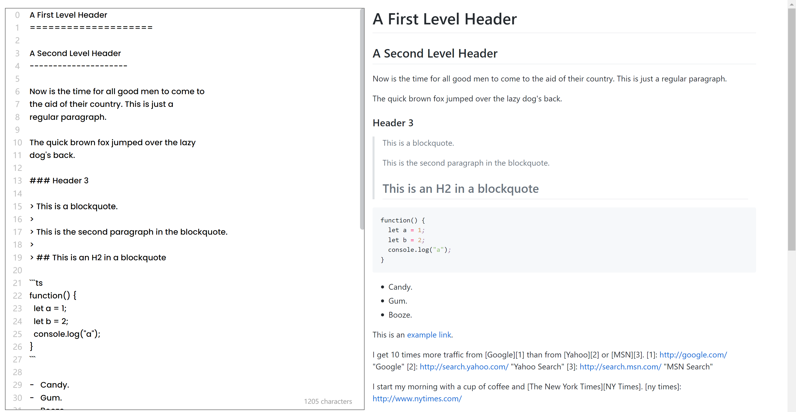

## Mark It

最终效果

### 功能
- 使用 marked + highlight.js，渲染输入的 markdown
- 显示行数
- tab 键监听
- 输入文字超过容器宽度，自动换行时添加换行符(\n)

### 不足
- 一次性粘贴很长的文本的时候，换行就没添加 \n，导致行号没更新
- 输入文字超过宽度，设置的是固定的一个字符串长度之后换行，当窗口减小时，这个长度应该是要变的
